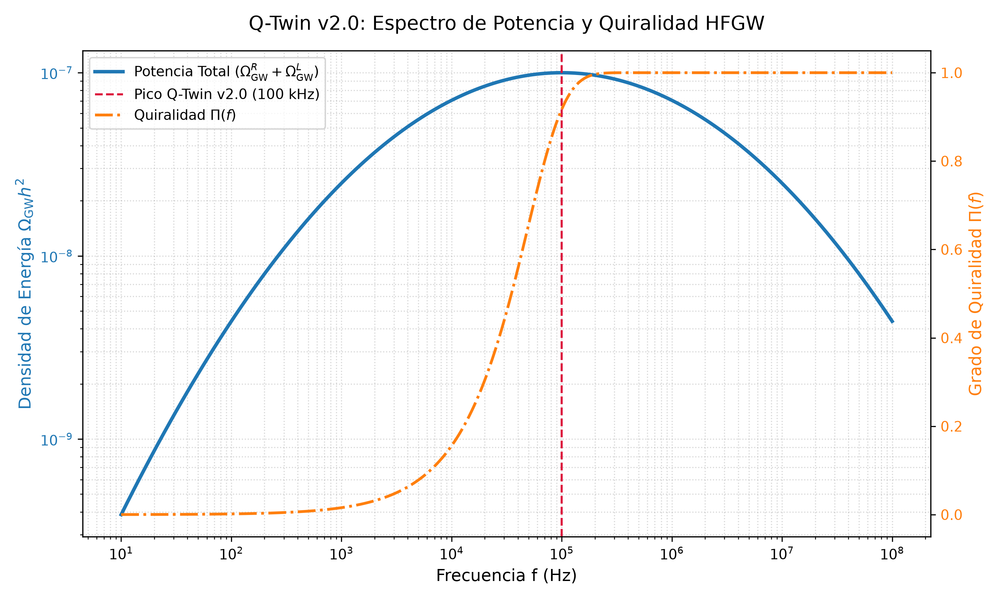

# Q-Twin v2.0: Hardware-in-the-Loop Quantum Gravity & Cosmology Emulator

**Q-Twin v2.0** es un emulador analógico de gravedad cuántica y cosmología de rebote no singular acelerado por hardware reconfigurable (ZCU216 RFSoC) y redes tensoriales MPDO (*Matrix Product Density Operators*).

El sistema simula en tiempo real la supresión del caos de Belinski-Khalatnikov-Lifshitz (BKL), la selección ambiental de estados puntero (*Einselection*), el colapso de la paridad de Wigner W(0,0) y la fase de recalentamiento post-rebote (H > 0).

---

## 🚀 Arquitectura y Física Fundamental

* **Motor Tensorial MPDO (chi = 32):** Representación eficiente del espacio de Liouville-Lindblad acotada por la ley de área 1D.
* **Precodificación de Maxwell (C⁻¹):** Inversión analítica de la matriz de capacitancia en topología serpentín con supresión de diafonía J_13 < -60 dB.
* **Regulación SMC (L_SMC):** Disipación cuántica suave que previene la singularidad inicial y fuerza un rebote cosmológico estable.
* **Telemetría Zero-Copy:** Mapeo de memoria `/dev/mem` a 250 MHz vía AXI4-Lite con streaming DMA a 32 MB/s.

---

## 📊 Observables Cosmológicos Extraídos

| Observable | Predicción Q-Twin v2.0 | Referencia Observacional |
| :--- | :--- | :--- |
| **Índice Espectral Escalar (n_s)** | 0.963 ± 0.004 | 0.9649 ± 0.0042 (Planck CMB) |
| **Bispectro Local (f_NL)** | 1.2 ± 2.4 | -0.9 ± 5.1 (Planck Limit) |
| **Razón Tensor-a-Escalar (r)** | < 10⁻³ | < 0.036 (BICEP / Keck Array) |
| **Índice Espectral Tensorial (n_t)** | Azul (n_t > 0) | Firma detectable para LISA / ET |
| **Paridad de Wigner (W00)** | -0.3183 -> +0.0462 | Transición Cuántico-Clásica Completa |

---

## 🗺️ Mapa de Registros AXI4-Lite (0xA000_0000)

| Dirección Física | Registro Hardware | Función / Parámetro |
| :--- | :--- | :--- |
| **0xA000_0000** | Qn_PHASE_CTRL | Amplitud Séxtica eps_NL (12.5 MHz) |
| **0xA000_0100** | CROSSTALK_COMP | Matriz Inversa C⁻¹ (16 x 16 Coeficientes) |
| **0xA000_0200** | SMC_SAT_EPSILON | Capa Límite Sigmoidal eps_sat = 0.140 |
| **0xA000_0300** | KAPPA_EFF_DISP | Tasa de Extracción kappa_eff = 1.0 MHz |

---

## 📁 Estructura del Repositorio

* **`simular_kasner.py`**: Simulación JIT del colapso de paridad de Wigner bajo cizalladura de Kasner.
* **`simular_recalentamiento.py`**: Modelo de transferencia de energía del condensado a la fase de radiación.
* **`export_mpdo_tensors.py`**: Pipeline de serialización de tensores de memoria M^[1,2,3] y metadatos observacionales en HDF5 / JSON.
* **`trascendent_rl_agent.py`**: Agente de aprendizaje por refuerzo para el control óptimo de fase AXI4-Lite en tiempo real.

---

## ⚙️ Instrucciones de Ejecución
---

---

## 📈 Benchmark Cosmológico HFGW y Quiralidad

El repositorio incluye el conjunto de datos de referencia y la proyección gráfica para el fondo estocástico de ondas gravitacionales de alta frecuencia (HFGW):

* **`hfgw_chiral_benchmark.json`**: Barrido espectral ($10\text{ Hz} - 100\text{ MHz}$) con densidad de energía total, grado de quiralidad ($\Pi(f)$) y descomposición en modos circulares ($\Omega_{\text{GW}}^R, \Omega_{\text{GW}}^L$).
* **`hfgw_spectrum_chiral.png`**: Curva espectral con pico en $100\text{ kHz}$ y transición a polarización circular neta en la banda de microondas.

## 📜 Licencia y Certificación

Este proyecto está certificado bajo la **Open Source Hardware Association (OSHWA)** y distribuido bajo la licencia MIT.
